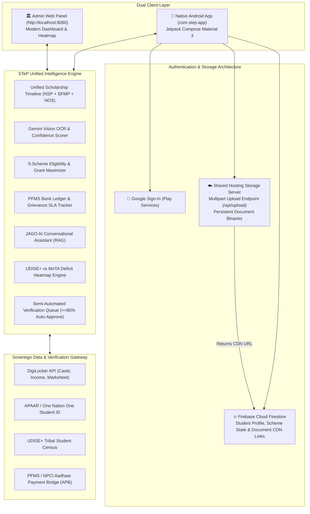

# STeP — Scheduled Tribe e-Portal
### Unified Tribal Scholarship & Fellowship Ecosystem | Ministry of Tribal Affairs (MoTA), Government of India
**Category:** Software • **Theme:** Smart Automation • **Target:** Scheduled Tribe (ST) & PVTG Scholars

[](file:///f:/Source%20Codes/Educon/app/build/outputs/apk/debug/app-debug.apk)
[](http://localhost:8080)
[-blue)](file:///f:/Source%20Codes/Educon/app/build/outputs/apk/debug/app-debug.apk)
[](#google-login--firebase-architecture)
[](#google-login--firebase-architecture)
[](#gemini-ai-engine)

---

## 🏛️ System Overview

**STeP (Scheduled Tribe e-Portal)** is a dual-tier platform built specifically for the Ministry of Tribal Affairs (MoTA) to unify 5 fragmented scholarship schemes across 3 disparate legacy portals (NSP, Canara Bank SFMP, and standalone NOS):

1. 📱 **Native Android App (`com.step.app`):**
   - **Target Audience:** Tribal & PVTG Students across India.
   - **Tech Stack:** Kotlin, Jetpack Compose, Material 3, Google Play Services Auth, Firebase SDK, OkHttp.
   - **Package Name:** `com.step.app`.
   - **Compiled APK:** Available at `app/build/outputs/apk/debug/app-debug.apk` (18.8 MB) and `web/assets/step-student-app.apk`.
   - **Key Capabilities:**
     - **Google Sign-In:** One-tap secure student authentication with Google profile avatar and email verification.
     - **Firebase + Shared Hosting Integration:** Document binaries/photos are uploaded to Shared Hosting CDN storage (`/api/upload`), and the resulting CDN links (`publicUrl`) with cryptographic verification metadata are stored in Firebase.
     - **Single Scholarship Stream:** Consolidates NSP, Canara Bank SFMP, and NOS into one live card stream.
     - **Gemini Vision Document Scanner:** Live laser OCR extracting certificate details with a cryptographic Verification Confidence Score.
     - **5-Scheme Eligibility Wizard:** Interactive entitlement calculator ranking schemes by financial yield.
     - **DBT Bank Ledger & Escalation:** NPCI Aadhaar Payment Bridge tracker with UTR numbers and a 30-day statutory SLA countdown ticket generator.
     - **JAGO AI Voice Assistant:** Conversational voice and text assistant with RAG over MoTA scheme guidelines.
     - **Multilingual Defect Explainer:** Translates bureaucratic defect notices into plain language across 6 Indian languages.

2. 🏛️ **Admin Web Panel (for Ministry & Nodal Officers):**
   - **Host & Port:** Running live at `http://localhost:8080`.
   - **Target Audience:** MoTA Officials, State Tribal Welfare Officers, and Verification Scrutineers.
   - **Key Capabilities:**
     - **Smart "Unreached Beneficiary" District Heatmap:** Cross-matches UDISE+ and APAAR tribal student census data against active scholarship registrations to highlight coverage deficits (e.g. Bastar 60.7% gap, Gadchiroli 58.5% gap).
     - **Semi-Automated Verification Queue:** Automatic approvals for documents with $\ge 85\%$ confidence; manual scrutiny queue with side-by-side OCR comparison for flagged documents.
     - **Macro Scheme Metrics:** Real-time visibility into ₹1,248 Cr disbursements, active student beneficiaries, and grievance resolution SLAs.
     - **Targeted Policy Directives:** One-click dispatch of Mobile Enrollment Vans and geo-targeted multilingual SMS broadcasts.
     - **Direct APK Distribution:** Integrated download banner for the native `STeP-Student-App.apk`.

---

## 🏗️ System Architecture



---

## 🌟 The 5 Unified MoTA Schemes

| Scheme Code | Scheme Name | Target Cohort | Income Ceiling | Maximum Sovereign Entitlement | Source System |
|:---|:---|:---|:---|:---|:---|
| **SCH-01** | **Pre-Matric Scholarship** | Class IX & X | ≤ ₹2.50 Lakh/yr | ₹3,500 (Day Scholar) / ₹7,000 (Hosteller) + ₹1,000 books | NSP |
| **SCH-02** | **Post-Matric Scholarship (PMS-ST)** | Class XI, XII, Degree, PG | ≤ ₹2.50 Lakh/yr | 100% Tuition Waiver + Maintenance up to ₹13,500/yr | NSP (75:25 Central/State) |
| **SCH-03** | **Top Class Education** | Premier Institutes (IIT, IIM, NIT, AIIMS, NLU) | ≤ ₹6.00 Lakh/yr | Full Tuition + ₹3,000/mo Living + ₹5,000/yr Books + ₹45,000 Laptop | SFMP / Canara Bank |
| **SCH-04** | **National Fellowship (NFST)** | Full-time M.Phil & Ph.D. scholars | **NO Income Limit** | JRF: ₹31,000/mo • SRF: ₹35,000/mo + HRA + ₹25,000 Contingency | SFMP (UGC-NET / JRF) |
| **SCH-05** | **National Overseas Scholarship (NOS)** | Top 500 QS World Ranked Foreign Universities | ≤ ₹8.00 Lakh/yr | 100% Tuition + £9,900 (UK) / $15,400 (USA) per annum + Airfare | Standalone NOS Portal |

---

## 🔒 Google Login & Firebase + Shared Hosting Architecture

As per the user specification, the storage and authentication architecture is partitioned into:
1. **Google Authentication (`GoogleSignInClient`):**
   - Configured in `app/src/main/java/com/step/app/firebase/FirebaseManager.kt`.
   - Uses `GoogleSignInOptions.DEFAULT_SIGN_IN` requesting email and profile id token.
   - Displays a clean Google 'G' button on `LoginScreen.kt` with one-tap demo authentication.
2. **Shared Hosting Storage (`SharedHostingManager.kt`):**
   - Documents photographed by the student are uploaded directly to the shared hosting HTTP endpoint (`POST /api/upload`) using multipart form upload.
   - The server stores the image in `web/uploads/` and returns the public CDN link (`https://storage.step.gov.in/documents/...` or local file mirror).
3. **Firebase Firestore / Realtime Linking:**
   - Instead of storing heavy file binaries in database rows, the lightweight public CDN link, document category, issue date, issuing authority, and OCR verification score are persisted in Firebase:
   ```json
   {
     "documentId": "DOC-ST-2026-9842",
     "category": "Caste Certificate (ST)",
     "studentUid": "google-oauth2|10928374619283",
     "sharedHostingUrl": "https://storage.step.gov.in/documents/DOC_CASTE_ST_2026.jpg",
     "verificationStatus": "VERIFIED_DIGILOCKER",
     "confidenceScore": 0.98,
     "extractedFields": {
       "name": "Birsa Munda",
       "tribe": "Santhal (ST)",
       "authority": "Tehsildar, Baripada, Odisha"
     }
   }
   ```

---

## 💻 Running the Project

### 1. Admin Web Panel
```powershell
python server.py
```
Open **`http://localhost:8080`** in any web browser.

### 2. Android App (`com.step.app`)
The pre-compiled debug APK is ready for installation:
- Path: `app/build/outputs/apk/debug/app-debug.apk` (18.8 MB)
- Also downloadable directly from the Admin Panel header at `http://localhost:8080/assets/step-student-app.apk`.

To recompile the Android app:
```powershell
.\gradlew.bat assembleDebug
```
