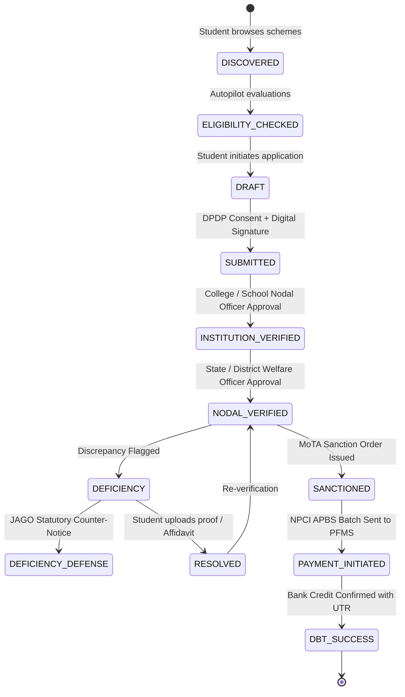

# STeP Sovereign Architecture & Smart Automation Implementation Plan
### Unified Tribal Scholarship & Fellowship Ecosystem
**Ministry of Tribal Affairs (MoTA) & National e-Governance Division (NeGD), Government of India**  
**Target Milestone:** Transition from Proto-3 Prototype to Enterprise Sovereign DPI

---

## 1. Executive Summary & Real-Codebase Audit Findings

Following a comprehensive audit of the active source files (`MainActivity.kt`, `FirebaseManager.kt`, `MoTaData.kt`, `ScholarshipDecisionEngine.kt`, `CryptoManager.kt`, `GeminiService.kt`, `EligibilityWizardScreen.kt`, `ScannerScreen.kt`, `DocumentWalletScreen.kt`, `HelpScreen.kt`, `LoginScreen.kt`, `AdminMainActivity.kt`, and `ScrutinyQueueScreen.kt`), this document outlines the exact implementation plan to upgrade the platform.

### Key Codebase Gaps Identified During Code Inspection:
1. **Hardcoded Eligibility Logic (`EligibilityWizardScreen.kt:L53-67`):** Matching is governed by static `if-else` index checks (`selectedEducation == 2 && selectedIncomeIndex <= 1`) rather than declarative, versioned scheme rules evaluating real academic cutoffs, entrance exam qualifiers, and statutory sub-quotas.
2. **Simulated Document Camera Capture (`DocumentWalletScreen.kt:L58-70`):** Capturing a certificate instantly creates a synthetic record with hardcoded strings (`confidenceScore = 98`, `autoApproveEligible = true`) rather than executing actual OCR extraction, field confidence scoring, and cross-document validation.
3. **Hardcoded Salt & Plaintext Fallback (`CryptoManager.kt:L27, L63, L93`):** Uses a static pepper string (`MoTA_STEP_TRIBAL_SOVEREIGN_2026_NIC_SECURE`) with PBKDF2 and falls back to unencrypted plaintext on exception, violating DPDP Act 2023 statutory encryption requirements.
4. **Missing Landing Language Selector (`LoginScreen.kt:L47-52`):** Starts immediately on `LoginStep.SIGN_IN` with Google Auth without offering an indigenous/regional language selector for PVTG and rural scholars.
5. **Simulated PFMS & Admin Sanction (`ScrutinyQueueScreen.kt` & `ScholarshipDecisionEngine.kt`):** Generates random mock UTRs and sanction numbers (`MOTA/2026-27/SANCT-...`) without an adapter architecture separating live endpoints from sandboxed/mock DBT gateways.
6. **No Cross-Document Discrepancy Resolver:** Differences in applicant names between Board Marksheets (e.g. *"Upadhyay Shashwat"*) and Aadhaar (e.g. *"Shashwat A.K.U."*) are completely unhandled, risking arbitrary bureaucratic rejection in the field.

---

## 2. The 10 Handwritten Smart Automation Pillars

```
┌────────────────────────────────────────────────────────────────────────────────────────┐
│                              SMART AUTOMATION SUITE                                    │
├──────────────────────────┬─────────────────────────────┬───────────────────────────────┤
│  ⚡ 1. Scholarship      │  📄 2. Document Autopilot   │  ⚖️ 4. Deficiency Defense     │
│     Autopilot            │     (6 Pillars / 4 Signals) │     (Anti-Corruption Engine)  │
│  • Doc Requirement Graph │  • 🟢 Ready (Green)         │  • Statutory citations        │
│  • Deadline Engine       │  • 🟡 Attention (Amber)     │  • MoTA circular backing      │
│  • OTR Completion Meter  │  • 🔴 Block (Red)           │  • Automated appeal draft     │
│  • Best-Fit Scheme Rank  │  • ⚪ N/A (Grey)            │  • Zero-bribe grievance flow  │
├──────────────────────────┼─────────────────────────────┼───────────────────────────────┤
│  🔍 6. Cross-Document    │  ⏰ 5. Document Expiry      │  🎙️ 8 & 9. PVTG Voice Assist  │
│     Consistency Engine   │     Radar                   │     & JAGO Conversational AI  │
│  • Fuzzy Name Matching   │  • DigiLocker sync watch    │  • Landing language selection │
│  • Marksheet vs Aadhaar  │  • Proactive expiry alerts  │  • Hands-free voice form      │
│  • Affidavit generation  │  • Renewal auto-trigger     │  • Two-way spoken audio AI    │
└──────────────────────────┴─────────────────────────────┴───────────────────────────────┘
```

### Pillar 1: Scholarship Autopilot & Autoplan Engine
- **Workflow:** Student Profile $\to$ Scheme Evaluation $\to$ Document Requirement Graph $\to$ Deadline Engine $\to$ **Autoplan**.
- **Autoplan Outputs:**
  1. *What and how documents are missing* for each scheme.
  2. *Eligibility count:* Exact count and list of schemes the candidate can apply for.
  3. *One-Time Registration (OTR) status:* Dynamic compliance percentage bar.
  4. *Best Scheme for You:* Recommends the highest-entitlement scheme (e.g., Top Class ₹2.86L vs Post-Matric ₹28.5k).
  5. *Expiration / Renewal Alert Calendar:* Proactive timeline of upcoming deadlines and validity expirations.

### Pillar 2: Document Autopilot & Application Readiness Matrix
- **Trigger:** Student asks JAGO *"Prepare my scholarship"* or triggers *Autopilot Scan*.
- **The 6 Evaluated Verification Pillars:**
  1. `ST Community Certificate`: Authenticated DigiLocker X.509 signature + Recognized Tribe name.
  2. `Annual Income Certificate`: Valid financial year window + within scheme ceiling.
  3. `Domicile / Residence Certificate`: State revenue digital stamp.
  4. `Academic Marksheets`: Class 10/12/UG marksheet satisfying percentage thresholds.
  5. `Institution Verification`: AISHE / EMRS / NIRF / Top 500 QS code match.
  6. `Bank / NPCI DBT Status`: Active Aadhaar Payment Bridge System (APBS) link.
- **4 Normalized Status Signals:**
  - 🟢 **Green (Ready):** Cryptographically verified, active date, 100% compliant.
  - 🟡 **Amber (Attention Needed):** Expiring within 30 days, minor name variant, re-upload recommended.
  - 🔴 **Red (Block):** Expired certificate, income ceiling breached, missing mandatory document.
  - ⚪ **Grey (Not Applicable):** Document not required for target scheme (e.g. income proof for NFST).

### Pillar 3: One Student Multi-Scheme Unified Eligibility Engine
- Multi-dimensional scheme rules replacing hardcoded wizard:
  - **Academic Cutoff Rules:** Enforcing minimum board percentages (e.g., $\ge 65\%$ for competitive slots).
  - **Entrance Exam & Institute Filters:** Mapping JEE Advanced, NEET, GATE, CAT, and UGC-NET ranks to premier institutions.
  - **PVTG Priority Quotas:** Reserving and prioritizing slots for the 75 recognized Particularly Vulnerable Tribal Groups.

### Pillar 4: Deficiency Autopilot & Anti-Corruption Defense
- **Problem Addressed:** Protects tribal students from harassment, arbitrary officer rejections, or bribe extortion when corrupt verifiers falsely declare authentic certificates "expired" or "invalid".
- **Capability:**
  - When an officer marks a deficiency, JAGO scans the rejection code.
  - Automatically correlates the rejection with governing MoTA Circulars and DigiLocker NeGD verification timestamps.
  - Generates a **Statutory Appeal Letter & Legal Counter-Notice** citing official Gazette orders.
  - Direct 1-click filing to the MoTA Grievance Portal & National Commission for Scheduled Tribes (NCST) with immutable cryptographic proof.

### Pillar 5: Document Expiry Radar & Automated Renewal Watchdog
- Proactive background monitor watching all DigiLocker documents.
- Dispatches statutory alerts at 60, 30, and 15 days before expiration via notifications, SMS triggers, and spoken JAGO reminders.
- Provides 1-click renewal sync to fetch the newly issued annual certificate directly from DigiLocker.

### Pillar 6: Cross-Document Consistency Engine
- **Discrepancy Resolver:** Analyzes candidate name, father's name, and DOB across Aadhaar, Class 10 Marksheet, and ST Certificate using Levenshtein distance, Soundex, and initials expansion.
- **Action Pathways:**
  - *Match Score $\ge 88\%$:* Automatically classified as *Acceptable Variation (Aadhaar Demographically Reconciled)*.
  - *Match Score $< 88\%$:* Flags exact discrepancy (e.g., *"Upadhyay Shashwat"* vs *"Shashwat A.K.U."*) and automatically drafts a ready-to-sign **MoTA Identity Affidavit & Rectification Form**.

### Pillar 7: Fraud Detection & NeGD Cryptographic DSC Seal Verification
- Verifies NeGD X.509 digital certificate signatures (`signerCn`, `dscSerialNumber`, NeGD PKI Root CA).
- Detects tampered PDF metadata, duplicated certificate numbers across UIDs, and suspicious date manipulations.

### Pillar 8: PVTG Voice-First Assist Mode
- **Initial Landing Page Selector:** First screen before sign-in presents a regional language selection grid: English, हिन्दी, ଓଡ଼ିଆ, मराठी, తెలుగు, தமிழ், Santhali, Gondi.
- **Hands-Free Spoken Onboarding:** The app speaks questions aloud in the chosen tongue, listens for verbal answers, and populates the profile without requiring text typing.

### Pillar 9: JAGO Sovereign Voice Assistant (Two-Way Voice AI)
- Complete voice-in / voice-out integration combining Android SpeechRecognizer + Gemini 1.5 Flash + on-device multilingual TTS.
- Contextual intent recognition with deep-link execution (e.g., *"Show my scholarship money status"* $\to$ navigates directly to DBT Screen).

### Pillar 10: "Explain My Scholarship" (Why, What, How)
- Transparent three-question breakdown for every student:
  - **WHY:** Why was I selected / rejected? (Line-by-line criteria audit).
  - **WHAT:** What exact entitlement is granted? (Tuition fees, living allowance, laptop grant).
  - **HOW:** How and when will the money reach my account? (PFMS APB UTR timeline).

---

## 3. Canonical Application Lifecycle State Machine

Replaces the 4-step UI with the statutory 11-step lifecycle:



---

## 4. Reusable Verification Registry ("Verify Once → Reuse Everywhere")

```kotlin
data class VerifiedDocumentRecord(
    val verificationId: String,          // e.g., "VID-2026-ST-849201"
    val docType: String,                 // "ST_CASTE", "INCOME", "MARKSHEET_10"
    val docSha256Hash: String,           // SHA-256 fingerprint of payload
    val issuingAuthority: String,
    val issueDate: String,
    val validityExpiryDate: String?,
    val isPermanent: Boolean,
    val negdDscVerified: Boolean,
    val consentScope: List<String>,      // ["SCH-01", "SCH-02", "SCH-03"]
    val reuseHistory: List<ReuseEvent>   // Audit log of schemes that consumed this verified record
)
```

---

## 5. Connector Architecture (Gov Integration Layer)

```
app/src/main/java/com/step/app/connectors/
├── Connector.kt                # Base Interface
├── DigiLockerConnector.kt      # OAuth2 PKCE + NeGD Gateway
├── NSPConnector.kt             # National Scholarship Portal Adapter
├── SFMPConnector.kt            # Canara Bank SFMP Adapter
├── NOSConnector.kt             # Standalone NOS Portal Adapter
├── PFMSConnector.kt            # NPCI Aadhaar Payment Bridge Adapter
└── MockConnector.kt            # Controlled Demo / Sandbox Fallback
```

---

## 6. Phased Implementation Roadmap

### Phase 1: Security Hardening & Foundational State Machine (P0)
- [ ] Remediate [CryptoManager.kt](file:///f:/Source%20Codes/Educon/app/src/main/java/com/step/app/security/CryptoManager.kt): Replace static salt with per-user dynamic salt; eliminate fallback returning plaintext on exception.
- [ ] Implement `ApplicationState.kt` and `ApplicationStateMachine.kt` (11 canonical states).
- [ ] Create domain models: `SchemeRule.kt`, `VerifiedDocumentRecord.kt`, `DeficiencyTicket.kt`, `ConsentRecord.kt`.

### Phase 2: Document Intelligence & Cross-Document Consistency (P0)
- [ ] Implement `CrossDocumentConsistencyEngine.kt`: Fuzzy name matching (Aadhaar vs Marksheet vs Caste certificate) and automated Affidavit generator.
- [ ] Implement `DocumentExpiryRadar.kt`: Background validity monitor for DigiLocker documents with proactive alert dispatches.
- [ ] Implement `DocumentAutopilot.kt`: 6-pillar assessment mapping to the 4 status signals (🟢, 🟡, 🔴, ⚪).

### Phase 3: Dynamic Eligibility Rules Engine & Autoplan (P0)
- [ ] Replace hardcoded index checks in `EligibilityWizardScreen.kt` with `EligibilityEngine.kt`.
- [ ] Build the **Scholarship Autopilot & Autoplan UI** displaying:
  - Missing documents graph
  - OTR completion percentage
  - Best-fit scheme recommendation
  - Statutory renewal calendar

### Phase 4: Deficiency Autopilot & Anti-Corruption Defense (P1)
- [ ] Implement `DeficiencyDefenseEngine.kt`: Correlates officer rejection with official MoTA circulars and DigiLocker timestamps.
- [ ] Build the interactive **Statutory Appeal Letter Modal** in `ApplicationDetailScreen.kt`.
- [ ] Connect JAGO to back-question officer rejections with statutory policy backing.

### Phase 5: PVTG Voice-First Assist Mode & Sovereign Voice Assistant (P1)
- [ ] Add initial **Language Selection Landing Grid** in `LoginScreen.kt` before Google sign-in.
- [ ] Integrate two-way spoken voice interaction (SpeechRecognizer + Gemini 1.5 Flash + on-device TTS).
- [ ] Implement "Explain My Scholarship" (Why, What, How) modal across all scheme screens.

### Phase 6: Admin Suite RBAC, Grievance Persistence & Gov Connectors (P1 / P2)
- [ ] Implement authenticated Admin login with RBAC: SuperAdmin, State Officer, Nodal Officer, Verification Auditor.
- [ ] Implement `GrievanceService.kt` with 15-day statutory SLA countdown timer.
- [ ] Implement `Connector.kt` abstraction with `DigiLockerConnector`, `NSPConnector`, `SFMPConnector`, `NOSConnector`, `PFMSConnector`, and `MockConnector` (transparently labelled for demo vs production).

---

## 7. Definition of Done for Production Readiness
1. **Zero Hardcoded Decisions:** Every eligibility calculation and document verification score is derived dynamically from verified certificates or OCR validation.
2. **Anti-Corruption Shield:** Any deficiency flagged by an officer can be contested immediately with an auto-generated statutory appeal citing MoTA circulars.
3. **No Stale Re-Uploads:** Documents verified once receive an immutable `VID` and can be reused across all 5 schemes without re-uploading.
4. **Security Hardening:** No hardcoded crypto salts, zero plaintext fallbacks, and no secrets committed in source code.
5. **PVTG Accessibility:** Indigenous tribal students can onboard completely hands-free via spoken local language voice guidance.
